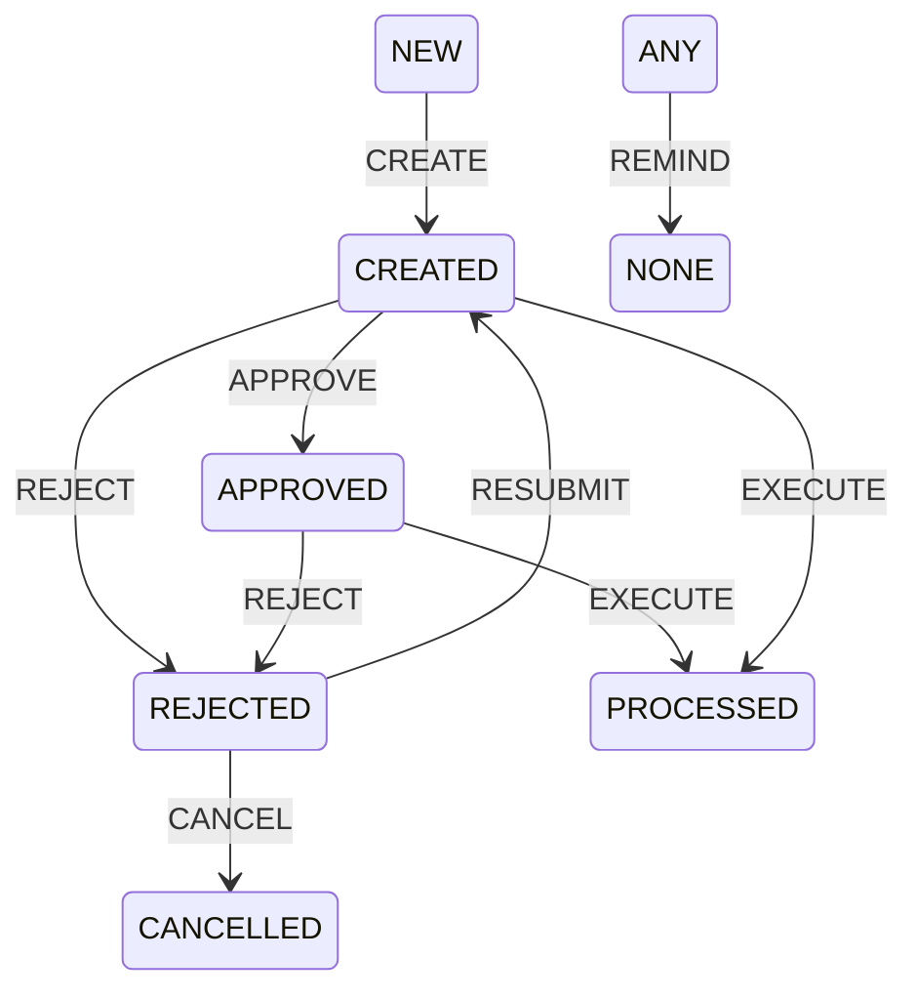

# DRBlanktter-Aviser

***

#### installationsvejledning

Kør BUILD.ps1
TST-DEPLOYT.ps1
PRD-DEPLOY.ps1

### Historie
Har tidligere været en del af 127, men er nu flyttet til selvstændig app

## Server oversigt

| Apex workspace | Application id | Schema    |
|----------------|----------------|-----------|
| DRBLANKET      | 450            | xxblanket |

| Environment | Database | Apex Workspace URL                    | Apex application URL                          | Single Signon                                              | Uden Kerberos (til REST oauth2)       |
|-------------|----------|---------------------------------------|-----------------------------------------------|------------------------------------------------------------|---------------------------------------|
| Development | APX1UDV  | http://apxudvpack.lx.dr.dk:7584/apex  | http://apxudvpack.lx.dr.dk:7584/apex/f?p=127  | NA                                                         | N/A                                   |
| Test        | APX1TST  | https://apxtstpack.lx.dr.dk:4396/apex | https://apxtstpack.lx.dr.dk:4396/apex/f?p=127 | https://apxtstpack.lx.dr.dk:4396/apex/f?p=127 (se noter *) | https://apxtstpack.lx.dr.dk:4397/apex |
|             |
| Production  | APX1PRD  | https://apxpack.lx.dr.dk:4393/apex    | https://apxpack.lx.dr.dk:4393/apex/f?p=127    | https://apxpack.lx.dr.dk:4393/apex/f?p=127                 | https://apxpack.lx.dr.dk:4392/apex    |

## Forudsætninger

Blanketsystemet
Tabellen bl_aviser

